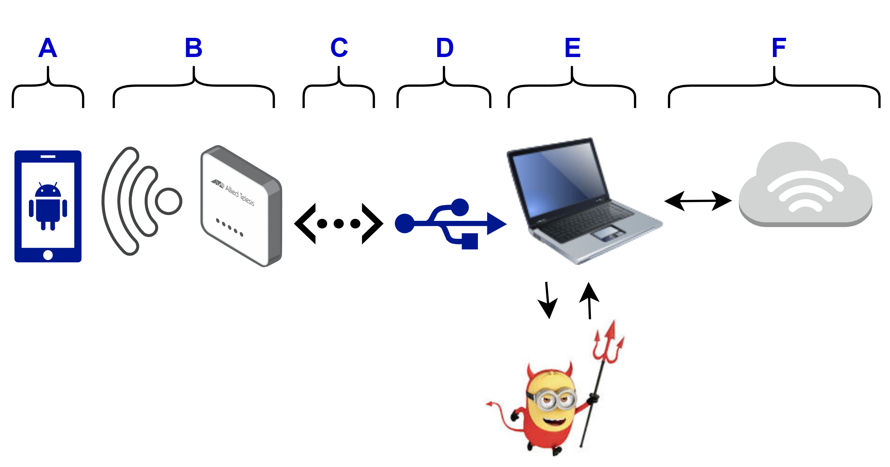

# Minion in the Middle

Welcome! This is an open source framework aimed at security researchers to facilitate conducting man-in-the-middle attacks against end-to-end encrypted messaging applications.
This is for testing purposes only and we thus do not include any obfuscation measures of the attack.

While this repository currently focusses on the open-source Signal Messenger, we plan to extend it to more applications in the future.

## Setup Overview

We expect the following setup:

(A) The **victim phone(s)** is connected to dedicated hardware access point (AP) via a **Wifi link** (B). 
The access point is connected to the laptop via an **ethernet link** (C) and an **ethernet-usb adapter** (D).
The setup script (@see [network setup](setup/network.py)) expects a Linux operating system (tested on Fedora 40/41 and Ubuntu 24) and sets up a [kea DHCP server](https://www.isc.org/kea/) to provide
IP addresses to the AP and the **victim phone(s)** over the newly created interface. 

(If you happen to be a stubborn Windows user that is running Linux in a VM, check out [these docs](setup/Hypervisor_bridgeing.md) for
instructions on how to bridge the AP through to your guest for both VMware and Hyper-V.)

Using dedicated hardware is the most stable way to create an additional networking interface on the **computer running the proxy**
(E) and thus the setup should *just work* independently of the hardware that was chosen. The setup finally also sets up the appropriate routing to forward traffic from the victim(s), to the proxy and finally to the internet (F).

