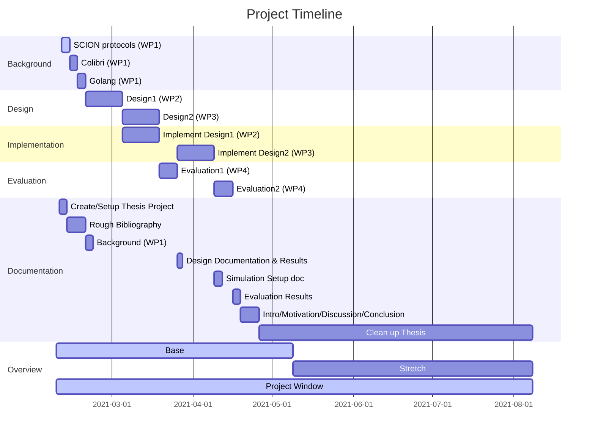

## Important Information

- **Student**:
- **Advisors**:
- **Start date**:
- **Submission date**:

## Timeline

*This should contain the timeline, which can be defined as a Gantt chart using [mermaid](https://mermaid-js.github.io/mermaid/). See example below.*

## Directory Structure

- [`notes`](./notes/README.md) contains lab notebooks and weekly reports.
- `project description` contains the project description.
- [`resources`](./notes/README.md) contains important resources like datasets, papers, and books.
- `thesis` contains the final thesis report.

## Thesis

- *Start writing **early**.*
- *Read [document about academic writing](https://cloud.inf.ethz.ch/s/Sdn8DybyAxZbtw3) and follow the rules described therein.*

## Evaluation

Our evaluation and grading criteria are listed in the [evaluation.csv](evaluation.csv) file.
