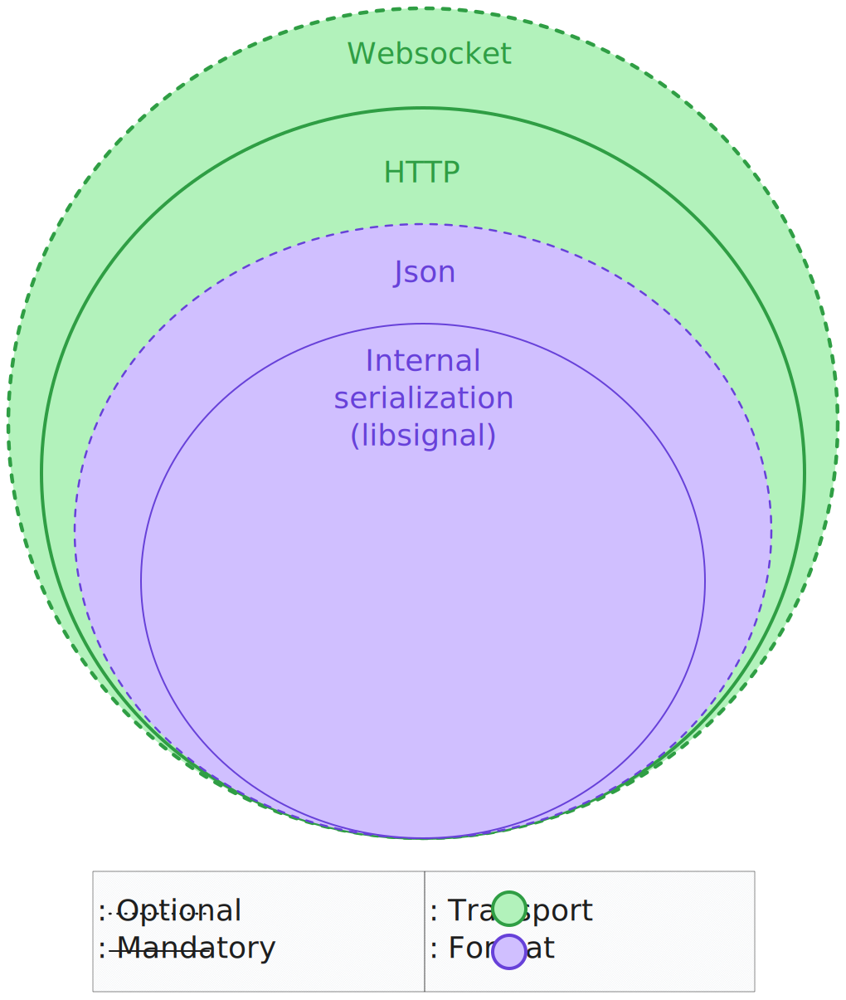
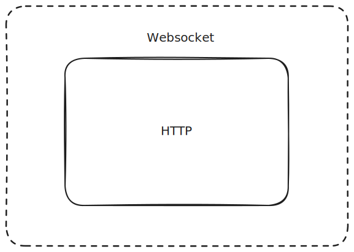
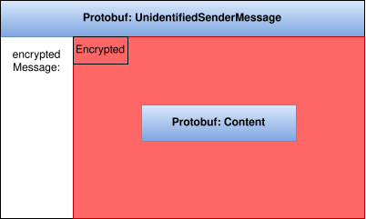

# Serialization
In general, data that we receive from the external world (client/server) consists in a "matrioska" of different serialization layers. 
<center>
	<figure>
		
		<figcaption><i>Matrioska</i> layers </figcaption>
	</figure>
</center>

## Transport layer

This covers how data is passed on the wire

<center>
	<figure>
		
		<figcaption> Transport mechanism </figcaption>
	</figure>
</center>

The first (optional) layer is a WebSocket layer, where the data is protobuf serialized in bytes. The schema followed is defined in ```WebSocketResourceProto```.

The second layer is the HTTP, where each request/response body is generally[^v1-messages] formatted as JSON. The field values can be primitive types (`int`, `str`, `bool`) or `base64` encoded bytes[^base-64].  

[^v1-messages]: (The exception is `/v1/api/message`, basically containing protobuf bytes).
[^base-64]: These bytes could represent a serialized protobuf, but can also come from other sources (the encryption of a message, rust structs, etc..).

## Content structure

The third layer is the data itself, which can be ```string```, ```int```, or ```bytes```. 
	As a general rule:
	- cryptographic keys are serialized as ```base64``` string encodings of bytes.
	- ids are serialized to ```int```.
	- messages are serialized in protobuf bytes. The schemes are defined in ```wire.proto``` and ```SignalService.proto```.

The fourth layer is the Internal Serialization layer which is handled by the `Orchestrator` module (internally calling the `libsignal` API). This layer is opaque to the end user (i.e., Mallory).
### Websocket ([_protobuf_](https://protobuf.dev/))

Part of the data is transmitted over the wire through [Websockets](https://developer.mozilla.org/en-US/docs/Web/API/WebSockets_API). 
Before transmission, data is serialized with the following outer protobuf schema [WebSocketMessage](https://github.com/signalapp/Signal-Android/blob/69e1146e2c5bbd6f2773dfe12f723e7cc88064be/libsignal-service/src/main/protowire/WebSocketResources.proto#L4) :

```protobuf
message WebSocketMessage {
	enum Type {
		UNKNOWN = 0;
		REQUEST = 1;
		RESPONSE = 2;
}
	optional Type type = 1;
	optional WebSocketRequestMessage request = 2;
	optional WebSocketResponseMessage response = 3;
}
```

The outer schema indicates the type of the message that is being exchanged.`WebsocketRequestMessage` and `WebSocketResponseMessage` define  HTTP requests and responses over websockets.
```protobuf
message WebSocketRequestMessage {
	optional string verb = 1;
	optional string path = 2;
	optional bytes body = 3;
	repeated string headers = 5;
	optional uint64 id = 4;
} 
message WebSocketResponseMessage {
	optional uint64 id = 1;
	optional uint32 status = 2;
	optional string message = 3;
	repeated string headers = 5;
	optional bytes body = 4;
}
```

For both schemes, the payload is the value of the field `body`.
### HTTP request/response
#### Plain
The following listed requests are intercepted as plain HTTP flows, meaning that there is no outer-serialization (such as websocket protobuf) that wraps them.

Each request and response is serialized with pre-defined JSON schemas. The relevant schemas are the following:
##### ```v1/registration```:

###### Request

<center>

| Field                 | Type     |
| --------------------- | -------- |
| (aci)registrationId   | `int`    |
| pniRegistrationId     | `int`    |
| unidentifiedAccesskey | `base64` |
| Identitykey           | `base64` |
| PqLastResortPreKey    | `base64` |
| keyId                 | `int`    |
| publicKey             | `base64` |
| signature             | `base64` |
| SignedPreKey          | `base64` |
| keyId                 | `int`    |
| publicKey             | `base64` |
| signature             | `base64` |

###### Response:

| Name         | Type     |
| ------------ | -------- |
| uuid (aciId) | `string` |
| pni          | `string` |
| number       | `string` |

##### `PUT v2/keys` :

###### Request

| pqPreKeys | 100 keys |
| --------- | -------- |
| keyId     | `int`    |
| publicKey | `base64` |
| signature | `base64` |

| PreKeys   | 100 keys |
| --------- | -------- |
| keyId     | `int`    |
| publicKey | `base64` |

##### `v2/keys/{uuid}` 
###### Response:

| pqPreKey           |                |          |
| ------------------ | -------------- | -------- |
|                    | keyId          | `int`    |
|                    | publicKey      | `base64` |
|                    | signature      | `base64` |
| **PreKey**         |                |          |
|                    | keyId          | `int`    |
|                    | publicKey      | `base64` |
|                    | registrationId | `int`    |
| **signedPreKey**   |                |          |
|                    | keyId          | `int`    |
|                    | publicKey      | `base64` |
|                    | signature      | `base64` |
| **identityKey**    |                | `base64` |
| **deviceId**       |                | `int`    |
| **registrationId** |                | `int`    |

</center>

### Websocket Protobuf Content
This HTTP request is the result of deserializing `WebsocketRequestMessage` and `WebsocketResponseMessage` (see [here](#websocket-protobuf)). Relevant content wrapped in this protobuf schema includes user profile info and exchanged Signal messages.
#### Profile info
A client interacts with the server to fetch information about the other users and themselves. This information is related to the profile of the user. Such as name, bio, identity key, payment, etc. Note that this information is encrypted with the profile key. 

<center>
	<figure>
		
		<figcaption>Profile response schema</figcaption>
	</figure>
</center>

#### Signal Messages
Users exchange different kinds of messages, which follow a predefined nested serialization schema:
<center>
	<figure>
		
		<figcaption> Structure of a serialized message on the wire  </figcaption>
	</figure>
</center>

This structure consists of several layers of serialization. The outer layers are HTTP requests over WebSocket, which define the transport mechanism with which the message is sent over the wire. Then, the first layer of serialization is `WebSocketMessage` as a request (see [here](#websocket-protobuf)). The ```body``` field of this protobuf schema contains either a JSON or `Envelope` protobuf depending on if the message was sent to or received by the server. In the innermost layer we have *Message* which contains the message, serialized according to its type as defined by the Signal messanger
##### Client initiated message
Client initiated messages represent messages sent by the user (client) on the wire to the ```v1/messages/{uuid}``` as a PUT request. 

```json
{
	"destination":"PNI:50c9062e-17ab-44d2-9ba8-6843c5945729", //string
	"messages":[
			{
				"content": base64, //protobuf
				"destinationDeviceId": int,
				"destinationRegistrationId": int,
				"type": int
			}
	],
	"online": boolean,
	"timestamp": int,
	"urgent": boolean
}
```
The above JSON structure represents _sent_ message(s) (i.e. the client is sending this request to the server). The `destination`  field is the destination's identifier (ACI or PNI) and `messages` is an array with one entry for each device linked to the same account. The sender must duplicate and encrypt the same plaintext with each device's key.

The `content` field contains a serialized protobuf wrapping the ciphertext generated by the crypto library. The protobuf schema is defined by the `type` field since it denotes the nature of the message.
The relevant protobuf schemas are `PreKeySignalMessage` (type 3) and `UnidentifedSenderMessage` (type 6).  

`PreKeySignalMessage` serializes the "first" message between two end users since it includes the cryptographic material to establish the session. 

`UnidentifiedSenderMessage` serializes the sealed sender message.
##### Server initiated message
Server initiated messages represents messages delivered by the server after a successful interaction with another client (e.g. another sending a message, see [here](#client-initiated-message)).

The relevant endpoint is ```api/v1/message```.

[//]: <> (TODO: Check if all Server initiated messaged are using /api/...)

```protobuf
message Envelope {
	enum Type {
		UNKNOWN = 0;
		CIPHERTEXT = 1;
		KEY_EXCHANGE = 2;
		PREKEY_BUNDLE = 3;
		RECEIPT = 5;
		UNIDENTIFIED_SENDER = 6;
		reserved 7; // SENDERKEY_MESSAGE
		PLAINTEXT_CONTENT = 8;
	}
	optional Type type = 1;
	reserved /*sourceE164*/ 2;
	optional string sourceServiceId = 11;
	optional uint32 sourceDevice = 7;
	optional string destinationServiceId = 13;
	reserved /*relay*/ 3;
	optional uint64 timestamp = 5;
	reserved /*legacyMessage*/ 6;
	optional bytes content = 8; // Contains an encrypted Content
	optional string serverGuid = 9;
	optional uint64 serverTimestamp = 10;
	optional bool urgent = 14 [default = true];
	reserved /*updatedPni*/ 15; // Not used presently, may be used in the future
	optional bool story = 16;
	optional bytes reportingToken = 17;
	reserved 18; // internal server use
	// NEXT ID: 19
}
```
Similar to [here](#client-initiated-message), the Message is contained in ```content```.
An [example](images/message_received_server_request.svg) shows all the layers of a PreKeySignalMessage received from another user.
##### Message (protobuf)
`Message (protobuf)` refers to Signal's schemas for encoding payloads based on their type. For example, when sending a message to an unknown user, the client includes the ciphertext of a "Hello" message and keys for session establishment. The message type guides the receiver in selecting the correct protobuf schema for deserialization.

In the following sections, we list the relevant structure that wraps the content of the message.
###### PreKeySignalMessage | type: 3

<center>
	<figure>
		
		<figcaption> Structure of a serialized message on the wire  </figcaption>
	</figure>
</center>

```protobuf
message PreKeySignalMessage {
	optional uint32 registration_id = 5;
	optional uint32 pre_key_id = 1;
	optional uint32 signed_pre_key_id = 6;
	optional uint32 kyber_pre_key_id = 7;
	optional bytes kyber_ciphertext = 8;
	optional bytes base_key = 2;
	optional bytes identity_key = 3;
	optional bytes message = 4; // SignalMessage
}
```

The value of the `message` field contains a serialized `SignalMessage`. This protobuf schema represents the message exchanged once the session has been established and contains the ratchet key and the ciphertext (bytes).
```protobuf
message SignalMessage {
	optional bytes ratchet_key = 1;
	optional uint32 counter = 2;
	optional uint32 previous_counter = 3;
	optional bytes ciphertext = 4;
}
```

`UnidentifiedSenderMessage` represents a [Sealed Sender](./sealed-sender.md) message.
###### UnidentifiedSenderMessage | type: 6
<center>
	<figure>
		
		<figcaption> Structure of a serialized message on the wire  </figcaption>
	</figure>
</center>

```protobuf
message UnidentifiedSenderMessage {
	// There are additional fields in the original protobuf message
	optional bytes ephemeralPublic = 1;
	optional bytes encryptedStatic = 2;
	optional bytes encryptedMessage = 3;
}
```
##### Protobuf: Content

Each message's encrypted payload contains serialized content of varying types. The `Content` protobuf schema enumerates different schemas corresponding to the various messages users can exchange.
```protobuf
message Content {
	optional DataMessage dataMessage = 1;	
	optional SyncMessage syncMessage = 2;	
	optional CallMessage callMessage = 3;	
	optional NullMessage nullMessage = 4;	
	optional ReceiptMessage receiptMessage = 5;	
	optional TypingMessage typingMessage = 6;	
	optional bytes senderKeyDistributionMessage = 7;	
	optional bytes decryptionErrorMessage = 8;	
	optional StoryMessage storyMessage = 9;	
	optional PniSignatureMessage pniSignatureMessage = 10;	
	optional EditMessage editMessage = 11;
}
```

In the table below, there is a description of the most relevant messages that pass on the wire.

| Protobuf       | Description                                                       |
| -------------- | ----------------------------------------------------------------- |
| DataMessage    | General text/attachment message                                   |
| ReceiptMessage | Notification message that shows that a message has been received  |
| TypingMessage  | "message" that shows that the other user is typing (i.e. bubbles) |
| EditMessage    | Shows the edit history of a message                               |

Note that, some text messages that contain *too much* text (> 2000 Bytes) will be sent as an encrypted text attachment (AttachmentPointer inside DataMessage). Attachments are fetched from a CDN and not sent in-band.


